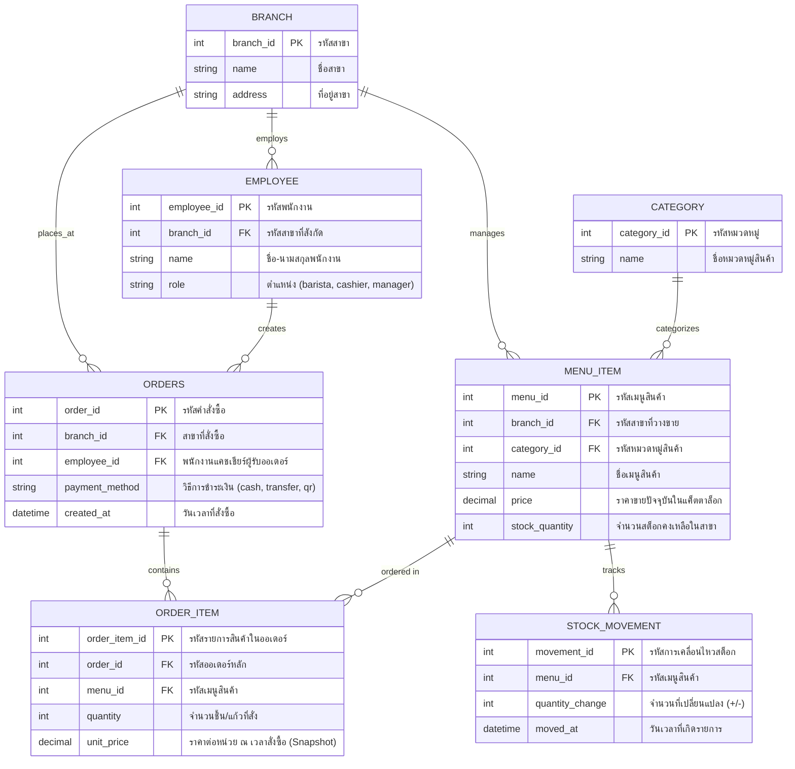

# เอกสารออกแบบ ER Diagram ระบบร้านกาแฟ (Coffee Shop POS System)

**รายวิชา:** 88734065 การวิเคราะห์และออกแบบระบบ (System Analysis and Design)  
**กิจกรรม:** Workshop สัปดาห์ที่ 7 ข้อ 1 และ 2

---

## 1. แผนภาพ Entity-Relationship Diagram (Mermaid)

---

## 2. ตารางสรุปรายละเอียด Entity, Primary Key, Foreign Key และ Attribute

| Entity               | Primary Key (PK) | Foreign Key (FK)                                       | Attributes อื่นๆ                  | หน้าที่ในระบบ                                                |
| :------------------- | :--------------- | :----------------------------------------------------- | :-------------------------------- | :----------------------------------------------------------- |
| **`CATEGORY`**       | `category_id`    | -                                                      | `name`                            | แยกประเภทสินค้า (กาแฟ, ชา, เบเกอรี่) เพื่อผ่าน 3NF           |
| **`BRANCH`**         | `branch_id`      | -                                                      | `name`, `address`                 | รองรับระบบหลายสาขาตามขอบเขตโครงงาน                           |
| **`EMPLOYEE`**       | `employee_id`    | `branch_id` -> `BRANCH`                                | `name`, `role`                    | เก็บข้อมูลพนักงาน (ใช้ Single-table สำหรับ Barista, Cashier) |
| **`MENU_ITEM`**      | `menu_id`        | `branch_id` -> `BRANCH` `category_id` -> `CATEGORY` | `name`, `price`, `stock_quantity` | รายการเมนูและสต็อกคงเหลือแยกรายสาขา                          |
| **`ORDERS`**         | `order_id`       | `branch_id` -> `BRANCH` `employee_id` -> `EMPLOYEE` | `payment_method`, `created_at`    | หัวคำสั่งซื้อหลัก (ตัด `total_amount` ออกตามหลัก 3NF)        |
| **`ORDER_ITEM`**     | `order_item_id`  | `order_id` -> `ORDERS` `menu_id` -> `MENU_ITEM`     | `quantity`, `unit_price`          | Associative Entity แก้ความสัมพันธ์ M:N และเก็บ snapshot ราคา |
| **`STOCK_MOVEMENT`** | `movement_id`    | `menu_id` -> `MENU_ITEM`                               | `quantity_change`, `moved_at`     | Audit Log ตรวจสอบการเพิ่ม/ลดสต็อกย้อนหลัง                    |

---

## 3. รายละเอียดความสัมพันธ์และ Cardinality

1. **`BRANCH` (1) — (N) `EMPLOYEE` (One-to-Many):**  
   หนึ่งสาขามีพนักงานปฏิบัติงานได้หลายคน พนักงานแต่ละคนสังกัดสาขาได้เพียงหนึ่งแห่ง
2. **`BRANCH` (1) — (N) `MENU_ITEM` (One-to-Many):**  
   หนึ่งสาขามีรายการเมนูและสต็อกสินค้าหลายรายการ สินค้าแต่ละแถวระบุจำนวนสต็อกเฉพาะสาขานั้น
3. **`BRANCH` (1) — (N) `ORDERS` (One-to-Many):**  
   หนึ่งสาขามีรายการออเดอร์เกิดขึ้นได้หลายรายการ
4. **`CATEGORY` (1) — (N) `MENU_ITEM` (One-to-Many):**  
   หนึ่งหมวดหมู่สินค้ามีเมนูบรรจุอยู่ได้หลายเมนู แต่ละเมนูจัดอยู่ในหมวดหมู่เดียว
5. **`EMPLOYEE` (1) — (N) `ORDERS` (One-to-Many):**  
   พนักงานแคชเชียร์หนึ่งคนสามารถสร้างและบันทึกออเดอร์ได้หลายรายการ
6. **`ORDERS` (1) — (N) `ORDER_ITEM` (One-to-Many / Composition):**  
   ออเดอร์หนึ่งรายการประกอบด้วยรายการสินค้าหลายรายการ หากลบออเดอร์ รายการย่อยใน `ORDER_ITEM` จะถูกลบตามไปด้วย (`ON DELETE CASCADE`)
7. **`MENU_ITEM` (1) — (N) `ORDER_ITEM` (One-to-Many / Aggregation):**  
   เมนูสินค้าหนึ่งรายการสามารถถูกอ้างอิงในรายการสั่งซื้อของลูกค้าได้หลายออเดอร์
8. **`MENU_ITEM` (1) — (N) `STOCK_MOVEMENT` (One-to-Many):**  
   เมนูสินค้าหนึ่งรายการมีประวัติการเข้า-ออกของสต็อกได้หลายครั้ง
