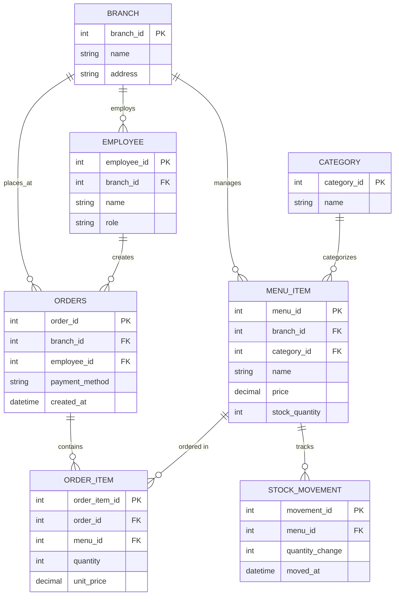

# รายงานผลการดำเนินกิจกรรม Workshop สัปดาห์ที่ 7 (ข้อ 1 - 7)
**รายวิชา:** 88734065 การวิเคราะห์และออกแบบระบบ (System Analysis and Design)  
**หัวข้อ:** การออกแบบข้อมูลและ Entity-Relationship Diagram สู่ MySQL Schema และ Model Layer  
**อ้างอิงเอกสาร:** [wk07.md](file:///c:/SA/week7.pdf)  

---

## ข้อ 1: ทบทวน Class Diagram จากสัปดาห์ที่ 6 และระบุ Entity ที่จำเป็นทั้งหมด

จาก Class Diagram สัปดาห์ที่ 6 (`Order`, `OrderItem`, `MenuItem`, `Employee`, `Barista`, `Cashier`) และข้อกำหนดระบบร้านกาแฟ (`CASE-STUDY-COFFEE-SHOP-STD.md`) ทีมได้วิเคราะห์และแปลงเป็น Entity สำหรับฐานข้อมูลเชิงสัมพันธ์ได้ดังนี้:

1. **`CATEGORY` (หมวดหมู่สินค้า):** สกัดออกมาจาก attribute `category` เดิมของ `MenuItem` เพื่อขจัดความซ้ำซ้อนและปฏิบัติตามหลัก 3NF
2. **`BRANCH` (สาขา):** เป็นขอบเขตหลักของระบบร้านกาแฟ เพื่อรองรับการจัดการสต็อกและรายงานยอดขายแยกตามสาขา
3. **`EMPLOYEE` (พนักงาน):** รวมคลาส `Employee`, `Barista`, `Cashier` เข้าด้วยกันโดยใช้กลยุทธ์ **Single-Table Inheritance** ผ่านคอลัมน์ `role` (`barista`, `cashier`, `manager`) เพราะในระดับฐานข้อมูลเชิงสัมพันธ์ไม่มีกลไก Inheritance โดยตรง
4. **`MENU_ITEM` (เมนูสินค้า):** แปลงมาจากคลาส `MenuItem` เพิ่ม `branch_id` เพื่อรองรับการตัดสต็อกรายสาขา และ `category_id` (FK)
5. **`ORDERS` (คำสั่งซื้อ):** แปลงมาจากคลาส `Order` โดยตัด method คำนวณ (`calculateTotal()`) ออก และตัดคอลัมน์ `total_amount` ออกเพื่อป้องกัน Update Anomaly
6. **`ORDER_ITEM` (รายการสินค้าในออเดอร์):** เป็น Associative Entity ที่แปลงมาจากเส้น Composition/Aggregation แบบ M:N ระหว่าง `Order` กับ `MenuItem` พร้อมทำ Snapshot ราคา ณ เวลาสั่งซื้อ (`unit_price`)
7. **`STOCK_MOVEMENT` (บันทึกความเคลื่อนไหวสต็อก):** เพิ่มเติมเพื่อรองรับฟังก์ชันการตัดสต็อกตามสูตรและตรวจสอบสต็อกย้อนหลัง (Audit Trail)

---

## ข้อ 2: ออกแบบ ER Diagram ฉบับสมบูรณ์

แผนภาพความสัมพันธ์ของข้อมูล (ER Diagram) ในรูปแบบ Mermaid Diagram:

---

## ข้อ 3: การตรวจสอบและปรับปรุงโครงสร้างตามหลัก Normalization (1NF ถึง 3NF)

ทีมได้ตรวจสอบโครงสร้างตารางทุกตารางอย่างละเอียดตามทฤษฎี Normalization:

### 3.1 การตรวจสอบ 1NF (First Normal Form)
- **เงื่อนไข:** ทุกคอลัมน์ต้องเก็บค่าที่เป็น Atomic Value (ค่าเดี่ยว) และไม่มีกลุ่มข้อมูลซ้ำ (Repeating Groups)
- **ผลการตรวจ:** ผ่าน 1NF ทุกตาราง โดยเฉพาะรายการสินค้าในออเดอร์ ไม่ได้เก็บเป็น String รวม (เช่น `"Latte, Mocha"`) แต่ถูกแยกออกมาเป็นตาราง `ORDER_ITEM` ทีละแถวอย่างชัดเจน

### 3.2 การตรวจสอบ 2NF (Second Normal Form)
- **เงื่อนไข:** ต้องผ่าน 1NF และไม่มี Partial Functional Dependency (ทุกคอลัมน์ที่ไม่ใช่คีย์ ต้องขึ้นอยู่กับ Primary Key ทั้งหมด)
- **ผลการตรวจ:** ตารางทุกตารางออกแบบโดยใช้ Single-column Primary Key (เช่น `order_id`, `menu_id`, `employee_id`, `order_item_id`) ไม่มีตารางใดที่ใช้ Composite Key จึงไม่มีทางเกิด Partial Dependency ส่งผลให้ผ่าน 2NF ทุกตาราง 100%

### 3.3 การตรวจสอบ 3NF (Third Normal Form)
- **เงื่อนไข:** ต้องผ่าน 2NF และไม่มี Transitive Functional Dependency (ห้ามมี non-key attribute ขึ้นอยู่กับ non-key attribute อื่น)
- **ผลการปรับปรุง:**
  1. แยก `category_name` ออกจาก `menu_item` ไปไว้ในตาราง `category` เพราะเดิม `menu_id -> category_id -> category_name` เป็น Transitive Dependency
  2. แยก `branch_name` และ `branch_address` ออกจาก `employee` ไปไว้ในตาราง `branch`
  3. **การตัด `total_amount` ออกจากตาราง `orders`:** เนื่องจากยอดรวมเป็น Derived Value ที่คำนวณได้จาก $\sum (\text{quantity} \times \text{unit\_price})$ ของตาราง `order_item` การเก็บซ้ำไว้จะเสี่ยงต่อ Update Anomaly
  4. **ข้อยกเว้นเชิงธุรกิจ (Snapshot):** การเก็บ `unit_price` ใน `order_item` เป็นความถูกต้องเชิงประวัติศาสตร์ทางบัญชี ไม่ถือว่าผิด Normalization

---

## ข้อ 4: การสร้างและตรวจสอบไฟล์ `wk07-schema.sql`

ทีมได้เขียนคำสั่ง SQL สำหรับ MySQL 8.0+ จัดเก็บไว้ที่ไฟล์ [wk07-schema.sql](file:///c:/SA/wk07-schema.sql) ครอบคลุม:
- การกำหนด `ENGINE=InnoDB DEFAULT CHARSET=utf8mb4`
- การสร้าง Foreign Key Constraints พร้อมระบุ `ON DELETE CASCADE / RESTRICT`
- การสร้าง Secondary Index เพื่อเพิ่มประสิทธิภาพในการ Query (`branch_id`, `category_id`, `created_at`, `status`)
- ข้อมูลจำลองตั้งต้น (Seed Mock Data) ครบทั้ง 7 ตารางเพื่อพร้อมใช้งานทดสอบทันที

---

## ข้อ 5: การ Import Schema เข้าฐานข้อมูล และการ Migrate โค้ดจาก Sprint 1

### 5.1 การ Migrate โครงสร้างฐานข้อมูลจาก Sprint 1 สู่ Sprint 2
1. **การเปลี่ยนชื่อ Primary Key:** ตาราง `orders` เดิมใน Sprint 1 ใช้ `id` ถูกเปลี่ยนเป็น `order_id` ตามหลักการตั้งชื่อที่ชัดเจนและสื่อความหมาย ป้องกันความสับสนเวลาเขียนคำสั่ง SQL `JOIN`
2. **การเพิ่ม Foreign Key:** เพิ่ม `branch_id` และ `employee_id` ในตาราง `orders`
3. **การแยกรายการสินค้า:** ยกเลิกการบันทึกยอดรวมก้อนเดียวใน `orders` แล้วเปลี่ยนเป็นบันทึกรายการแยกลงในตาราง `order_item`
4. **การคำนวณยอดเงิน:** ปรับแต่ง Query ใน Controller/Model ให้ใช้ `SUM(quantity * unit_price)` ในการดึงยอดสุทธิ

---

## ข้อ 6: การเขียน Model Layer และตรวจสอบ Checklist 4.4

ทีมได้พัฒนาไฟล์ Model ในภาษา JavaScript (Node.js) จำนวน 2 โมเดล ได้แก่:
1. [menuModel.js](file:///c:/SA/menuModel.js) — จัดการข้อมูลเมนู ค้นหาตามสาขา และปรับสต็อกสินค้า
2. [orderModel.js](file:///c:/SA/orderModel.js) — จัดการธุรกรรมการสั่งซื้อ (Transaction), บันทึก order & order_item, ตัดสต็อก และคำนวณยอดรวมสด

### ตารางตรวจสอบ Mapping 3 ทาง (Class Diagram vs ER Schema vs Model):

| Class Diagram (`wk06.md`) | ER Schema (`wk07-schema.sql`) | Model Layer (`orderModel.js`) | สถานะความสอดคล้อง |
| :--- | :--- | :--- | :--- |
| `orderId` | `order_id` (INT PK) | `order_id` | สอดคล้องสมบูรณ์ |
| `branch` | `branch_id` (INT FK) | `branch_id` | สอดคล้องสมบูรณ์ |
| `employee` | `employee_id` (INT FK) | `employee_id` | สอดคล้องสมบูรณ์ |
| `paymentMethod` | `payment_method` (VARCHAR) | `payment_method` | สอดคล้องสมบูรณ์ |
| `createdAt` | `created_at` (DATETIME) | `created_at` | สอดคล้องสมบูรณ์ |
| `OrderItem.unitPrice` | `unit_price` (DECIMAL) | `unit_price` | สอดคล้องสมบูรณ์ (Snapshot) |
| `OrderItem.quantity` | `quantity` (INT) | `quantity` | สอดคล้องสมบูรณ์ |
| `calculateTotal()` (Method) | *(ไม่มี column)* | Method `COALESCE(SUM(...))` | สอดคล้อง (คำนวณสด ไม่เก็บซ้ำ) |

---

## ข้อ 7: รายการสรุปไฟล์ผลลัพธ์ที่จัดเตรียมไว้ครบถ้วน

1. **`wk07-er-diagram.md`** : [wk07-er-diagram.md](file:///c:/SA/wk07-er-diagram.md) — รายละเอียด ER Diagram, Entity, Attributes และ Cardinality
2. **`wk07-schema.sql`** : [wk07-schema.sql](file:///c:/SA/wk07-schema.sql) — ไฟล์ MySQL 8.0 DDL & Seed Data ฉบับสมบูรณ์
3. **`menuModel.js`** : [menuModel.js](file:///c:/SA/menuModel.js) — Model สำหรับตาราง `menu_item`
4. **`orderModel.js`** : [orderModel.js](file:///c:/SA/orderModel.js) — Model สำหรับตาราง `orders` และ `order_item`
5. **`wk07-67160028.md`** : [wk07-67160028.md](file:///c:/SA/wk07-67160028.md) — ไฟล์เดี่ยววิเคราะห์ความถูกต้องของ Normalization ตาม [wk07-rubric.md](file:///c:/SA/wk07-rubric.md) (สำหรับรหัสนิสิต 67160028)
