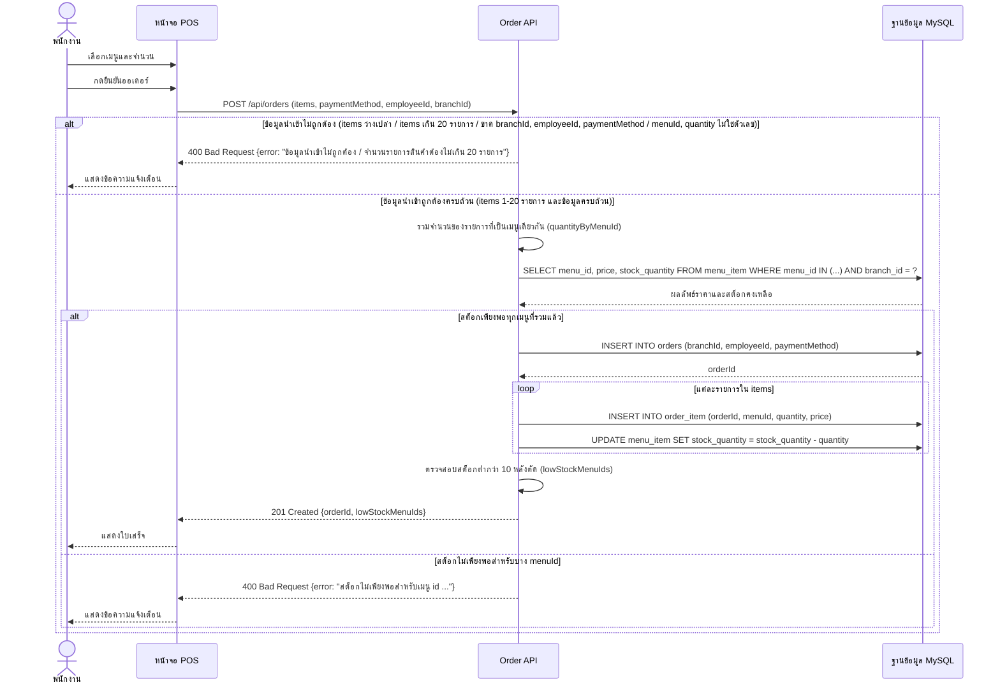

# งานเดี่ยว สัปดาห์ที่ 9: วิเคราะห์ความเสี่ยงของ Business Logic และปรับปรุง Sequence Diagram (CLO1)

**รหัสนิสิต:** 67160028  
**ชื่อ-นามสกุล:** นายณัฐวุฒิ  
**รายวิชา:** 88734065 การวิเคราะห์และออกแบบระบบ (System Analysis and Design)  

---

## โจทย์ที่ 1: วิเคราะห์ความเสี่ยงของ Business Logic ในโค้ด `createOrder`

### 1.1 การวิเคราะห์ปัญหาเมื่อตัดการรวมจำนวน (`quantityByMenuId`) ก่อนเช็คสต็อก

#### 1. กลไกการเกิดข้อผิดพลาด (Bug Mechanism)

หากตัดขั้นตอนการรวมจำนวนด้วย `quantityByMenuId` ออก แล้วเปลี่ยนไปตรวจสอบสต็อกทีละบรรทัด (`item` ใน `items`) โดยตรง จะก่อให้เกิดข้อผิดพลาดร้ายแรงเนื่องจาก:

- **การตรวจสอบแยกอิสระต่อกัน (Independent Validation):** ในขั้นตอนการตรวจสอบสต็อกก่อนสั่งซื้อ (Pre-order Validation) สต็อกในฐานข้อมูลยังไม่ได้ถูกตัดจริง แต่ละบรรทัดจะนำจำนวนที่ตนเองต้องการไปเทียบกับ "สต็อกคงเหลือเต็มจำนวนในฐานข้อมูล"
- **ไม่รับรู้ความต้องการของบรรทัดอื่น (Lack of Aggregate Awareness):** แต่ละบรรทัดตรวจสอบผ่านได้ด้วยตัวเองเพราะจำนวนที่ขอในบรรทัดนั้นน้อยกว่าหรือเท่ากับสต็อกคงเหลือ โดยที่ระบบไม่ได้นำความต้องการของบรรทัดอื่นที่เป็นสินค้าเมนูเดียวกันมาคำนวณรวม ส่งผลให้ผ่านการตรวจสอบทั้งที่ผลรวมของทุกบรรทัดเกินสต็อกที่มีอยู่จริง

#### 2. ตัวอย่างตัวเลขจำลองรูปธรรม (Concrete Numerical Example)

สมมติสถานะสต็อกและคำสั่งซื้อของร้านกาแฟ ดังนี้:

- **สต็อกคงเหลือในฐานข้อมูล:** เมนู "Latte" มีสต็อกคงเหลือ **3 หน่วย** (`stock_quantity = 3`)
- **คำสั่งซื้อของลูกค้า (ใน 1 ออเดอร์เดียวกัน):** ลูกค้าสั่ง Latte แยกเป็น 2 บรรทัด (เช่น บรรทัดแรกหวานน้อย บรรทัดสองหวานปกติ):
  - บรรทัดที่ 1 (Item 1): Latte จำนวน **2 หน่วย**
  - บรรทัดที่ 2 (Item 2): Latte จำนวน **2 หน่วย**
  - _(ความต้องการใช้งานจริงรวมกัน = $2 + 2 = 4$ หน่วย ซึ่งเกินกว่าสต็อกที่มีอยู่จริง 3 หน่วย)_

**ผลการทำงานเมื่อตรวจสอบทีละบรรทัดโดยไม่รวมจำนวนก่อน:**

1. **ตรวจสอบ Item 1:** ต้องการ 2 หน่วย เทียบกับสต็อกในฐานข้อมูล (3 หน่วย) $\rightarrow$ เงื่อนไข $2 \le 3$ เป็นจริง $\rightarrow$ **ผ่านการตรวจสอบ**
2. **ตรวจสอบ Item 2:** ต้องการ 2 หน่วย เทียบกับสต็อกในฐานข้อมูลที่ยังคงเป็น 3 หน่วย (เพราะยังไม่ถึงขั้นตอนตัดสต็อก) $\rightarrow$ เงื่อนไข $2 \le 3$ เป็นจริง $\rightarrow$ **ผ่านการตรวจสอบ**

#### 3. ผลกระทบจริงต่อระบบ (Real-World Impact)

เมื่อผ่านการตรวจสอบ ระบบจะเข้าสู่ลูปการตัดสต็อกจริงในขั้นตอนถัดไป (`UPDATE menu_item SET stock_quantity = stock_quantity - ?`):

- บรรทัดที่ 1 ตัดสต็อก 2 หน่วย: สต็อกลดลงจาก 3 เหลือ $3 - 2 = 1$ หน่วย
- บรรทัดที่ 2 ตัดสต็อกอีก 2 หน่วย: สต็อกลดลงจาก 1 กลายเป็น $1 - 2 = \mathbf{-1}$ **หน่วย**

**ผลลัพธ์:** สต็อกสินค้าในระบบกลายเป็น **ค่าติดลบ (-1)** เกิดภาวะ **Overselling (ขายสินค้าเกินสต็อกจริง)** ลูกค้าได้รับใบเสร็จยืนยันคำสั่งซื้อเรียบร้อย แต่บาริสต้าหน้าร้านไม่มีวัตถุดิบชงกาแฟให้ลูกค้า เกิดความเสียหายต่อการปฏิบัติงาน ความน่าเชื่อถือของร้าน และทำให้ข้อมูลทางบัญชีสินค้าคลาดเคลื่อน

---

### 1.2 การวิเคราะห์ Race Condition ในบริบทของ Concurrency และแนวทางแก้ไข

#### 1. ตารางลำดับเวลาจำลองเหตุการณ์ (Timeline of Race Condition)

กำหนดให้สถานะเริ่มต้น: เมนู "Americano" มีสต็อกคงเหลือ **3 หน่วย**  
มีพนักงาน 2 คน (Cashier 1 ส่ง Request A และ Cashier 2 ส่ง Request B) กดยืนยันออเดอร์เมนู Americano เข้ามาพร้อมกันในเวลาไล่เลี่ยกัน โดยแต่ละคนสั่งคนละ **2 หน่วย** (ความต้องการรวมคือ 4 หน่วย เกินสต็อกที่มี 3 หน่วย):

| ลำดับเวลา (Timeline) | Request A (พนักงาน 1: สั่ง 2 หน่วย)           | Request B (พนักงาน 2: สั่ง 2 หน่วย)           | ค่า `stock_quantity` ในฐานข้อมูล | คำอธิบายสถานะและการทำงาน                                           |
| :------------------: | :-------------------------------------------- | :-------------------------------------------- | :------------------------------: | :----------------------------------------------------------------- |
|        $T_1$         | ส่งคำสั่ง `SELECT` เช็คสต็อก                  | -                                             |                3                 | Request A อ่านค่าสต็อกได้ 3 หน่วย                                  |
|        $T_2$         | -                                             | ส่งคำสั่ง `SELECT` เช็คสต็อก                  |                3                 | Request B อ่านค่าสต็อกได้ 3 หน่วย (ตัดหน้าก่อนที่ A จะทันอัปเดต)   |
|        $T_3$         | เช็คเงื่อนไข $2 \le 3$ $\rightarrow$ **ผ่าน** | -                                             |                3                 | Request A เห็นว่าสต็อกพอ จึงดำเนินขั้นตอนถัดไป                     |
|        $T_4$         | -                                             | เช็คเงื่อนไข $2 \le 3$ $\rightarrow$ **ผ่าน** |                3                 | Request B เห็นว่าสต็อกพอ (เพราะได้ค่าเดิม 3) จึงดำเนินขั้นตอนถัดไป |
|        $T_5$         | ส่งคำสั่ง `UPDATE` ตัดสต็อก 2 หน่วย           | -                                             |                1                 | Request A บันทึกสำเร็จ สต็อกลดลงเหลือ $3 - 2 = 1$                  |
|        $T_6$         | -                                             | ส่งคำสั่ง `UPDATE` ตัดสต็อก 2 หน่วย           |              **-1**              | Request B บันทึกสำเร็จ สต็อกลดลงเหลือ $1 - 2 = \mathbf{-1}$        |

**สรุปผลลัพธ์:** เกิดสต็อกติดลบ (-1 หน่วย) เนื่องจากทั้งสอง Request สลับกันทำงาน โดยต่างฝ่ายต่างตรวจสอบผ่านบนฐานข้อมูลเดิมก่อนที่อีกฝ่ายจะตัดสต็อกเสร็จ

#### 2. การเชื่อมโยงกับสาเหตุเชิงเทคนิค (Technical Root Cause)

ความผิดพลาดนี้เกิดจากคำสั่ง `SELECT` (ตรวจสอบสต็อก) และ `UPDATE` (ตัดสต็อก) เป็นคำสั่งที่แยกอิสระจากกันคนละคำสั่ง (Non-atomic Operation) โดยไม่มีกลไก Concurrency Control:

- เกิด **Race Window (ช่องว่างทางเวลา)** ระหว่างจังหวะที่อ่านข้อมูล (Time-of-Check) กับจังหวะที่บันทึกข้อมูลจริง (Time-of-Use) หรือปรากฏการณ์ **TOCTOU**
- Request B อ่านข้อมูลที่เป็น **Stale Data (ข้อมูลเก่าที่กำลังจะเปลี่ยน)** ทำให้การตัดสินใจทาง Business Logic ผิดพลาด

#### 3. แนวทางการแก้ไขเชิงหลักการ (Technical Solution)

แก้ไขโดยใช้ **Database Transaction** ควบคู่กับ **Pessimistic Locking (`SELECT ... FOR UPDATE`)**:

1. เริ่มต้นธุรกรรมด้วย `START TRANSACTION;`
2. ดึงข้อมูลสต็อกพร้อมล็อกแถวข้อมูลด้วย Exclusive Lock (X-Lock):
   ```sql
   SELECT menu_id, price, stock_quantity
   FROM menu_item
   WHERE menu_id = ?
   FOR UPDATE;
   ```
3. **กลไกการทำงาน:** เมื่อ Request A ใช้ `FOR UPDATE` ฐานข้อมูลจะล็อกแถวสินค้านั้นไว้ หาก Request B ส่งคำสั่งขออ่านข้อมูลแถวเดียวกัน Request B จะถูกสั่งให้ **รอ (Block/Wait)** ทันที จนกว่า Request A จะทำการ `UPDATE` ตัดสต็อกและสั่ง `COMMIT;` (หรือ `ROLLBACK;`) เรียบร้อย
4. เมื่อ Request A ปลดล็อก Request B จึงจะอ่านค่าสต็อกใหม่ที่อัปเดตแล้วได้ ซึ่งจะเห็นสต็อกคงเหลือเพียง **1 หน่วย**
5. Request B ตรวจสอบเงื่อนไขพบว่าความต้องการ (2 หน่วย) มากกว่าสต็อกคงเหลือ ($2 > 1$) จึงปฏิเสธคำสั่งซื้อและตอบกลับ `400 Bad Request` ได้อย่างถูกต้อง สต็อกจึงไม่ติดลบ

---

## โจทย์ที่ 2: แก้ไข Sequence Diagram ให้รองรับ Business Logic ใหม่

### 2.1 เหตุผลของการใช้ `loop` fragment ครอบ `INSERT INTO order_item` และ `UPDATE menu_item`

#### 1. เหตุผลที่ต้องใช้ `loop` fragment

`loop` fragment ใน Sequence Diagram ใช้เพื่อสื่อถึง **พฤติกรรมจริงของระบบที่มีการทำงานซ้ำตามจำนวนข้อมูลนำเข้า (Dynamic Iteration)**:

- ในโค้ดจริงหัวข้อ 3.1 มีการใช้ `for (const item of items)` เพื่อประมวลผลรายการสินค้าทีละรายการ
- สำหรับแต่ละ `item` ในอาร์เรย์ `items` ระบบจะต้องส่งคำสั่ง `INSERT INTO order_item` เพื่อบันทึกแถวรายการ และส่งคำสั่ง `UPDATE menu_item` เพื่อตัดสต็อกสินค้าทีละเมนู
- ดังนั้น หากออเดอร์มี $N$ รายการ คำสั่ง SQL ทั้งสองจะถูกส่งไปยังฐานข้อมูลซ้ำๆ จำนวน $N$ รอบ (รวมเป็น $2N$ queries) ไม่ใช่การส่งคำสั่งเพียงครั้งเดียว

#### 2. ผลกระทบหากลบ `loop` fragment ออก

หากลบ `loop` fragment ออกแล้วปล่อยให้ข้อความทั้งสองอยู่นอกกรอบ loop จะทำให้ผู้อ่านแผนภาพ (เช่น นักพัฒนาคนอื่นในทีม หรือ System Architect ที่ไม่ได้ดูโค้ดจริง) เข้าใจผิดในประเด็นสำคัญ:

- **เข้าใจผิดเรื่องสถาปัตยกรรมการเรียกข้อมูล (Misunderstanding Execution Flow):** ผู้อ่านจะเข้าใจผิดว่าระบบทำงานแบบ Single Batch Query หรือ Bulk Operation (เช่น การทำ Bulk Insert เพียง 1 คำสั่งต่อหนึ่งออเดอร์ $O(1)$)
- **ประเมินประสิทธิภาพระบบต่ำกว่าความเป็นจริง (Underestimating Database Load):** ผู้อ่านจะไม่เห็นปัญหา **N+1 Query Overhead** และภาระ Network Latency / Round-trip Time ระหว่าง Server กับ Database ที่เพิ่มขึ้นตามจำนวนรายการสินค้าในตะกร้า
- **บดบังความเสี่ยงด้าน Transaction & Concurrency:** ตามที่ระบุใน wk09.md หัวข้อ 1.3 หากไม่มี `loop` จะมองไม่เห็นจุดเสี่ยงว่าคำสั่ง SQL เหล่านี้ถูกยิงแยกเป็นรายคำสั่งโดยไม่มี Transaction คลุม หากเกิดข้อผิดพลาดที่รายการที่ 3 รายการที่ 1 และ 2 จะถูกตัดสต็อกค้างไว้โดยไม่ถูก Rollback แผนภาพที่มี `loop` จะช่วยสื่อสารให้นักพัฒนาตระหนักถึงความจำเป็นในการครอบ Transaction ได้อย่างชัดเจน

---

### 2.2 การปรับปรุง Sequence Diagram สำหรับเงื่อนไขจำกัดรายการสินค้าไม่เกิน 20 รายการ (`items.length > 20`)

#### 1. Mermaid Code Block ส่วนที่เพิ่ม/แก้ไขจากหัวข้อ 1.2



#### 2. คำอธิบายเหตุผลของการรวมไว้ใน Alt Fragment ชั้นนอกเดิม

เงื่อนไข `items.length > 20` **ควรจัดรวมอยู่ใน alt fragment ชั้นนอกเดิม (ฝั่ง "ข้อมูลนำเข้าไม่ถูกต้อง")** โดยไม่ควรแยกเป็น alt fragment ชั้นใหม่ต่างหาก ด้วยเหตุผลทางสถาปัตยกรรมดังนี้:

1. **ลักษณะของการตรวจสอบเป็นประเภทเดียวกัน (Syntactic Request Validation):**  
   เงื่อนไข `items.length > 20` เป็นการตรวจสอบความสมบูรณ์และข้อกำหนดของ Request Payload โดยตรง สามารถตรวจได้ทันทีจากหน่วยความจำของ Boundary Layer (Controller) โดยไม่ต้องพึ่งพาข้อมูลภายนอกและไม่ต้องรอผลการ Query ฐานข้อมูล ซึ่งมีลักษณะเหมือนกับเงื่อนไขเดิมในชั้นนอกทุกประการ (เช่น `items` ว่างเปล่า, ฟิลด์บังคับขาดหาย, หรือชนิดข้อมูลไม่ถูกต้อง)
2. **รักษาเจตนารมณ์ของการแบ่ง Alt 2 ชั้น (Separation of Validation Phases):**  
   โครงสร้าง Sequence Diagram ในหัวข้อ 1.2 ถูกแบ่งออกเป็น 2 ชั้นตาม "ระยะการประมวลผลและแหล่งข้อมูล" อย่างชัดเจน:
   - **Alt ชั้นนอก (Pre-DB Validation):** ทำหน้าที่เป็น Guard Clauses กรองคำขอที่ไม่ถูกต้องทิ้งทันที เพื่อป้องกันไม่ให้คำขอที่ไม่สมบูรณ์สิ้นเปลือง Database Connection หรือ I/O Resource
   - **Alt ชั้นใน (Post-DB Business Rule Validation):** ทำหน้าที่ตัดสินใจ Business Logic ที่ต้องพึ่งพาข้อมูลจริงจากฐานข้อมูล (เช่น การตรวจสอบสต็อกคงเหลือ)  
     การเพิ่ม `items.length > 20` เข้าไปใน alt ชั้นนอกจึงสอดคล้องกับหลักการนี้อย่างสมบูรณ์
3. **ลดความซับซ้อนของแผนภาพและตรงกับโครงสร้างโค้ดจริง (Diagram Simplicity & Code Cohesion):**  
   ในโค้ดจริง `orderController.js` การตรวจ `items.length > 20` ถูกเขียนเป็น Guard Clause ในระดับเดียวกันกับ `if (!Array.isArray(items) || items.length === 0)` หากเรานำไปแยกเป็น alt ซ้อนอีกชั้นหนึ่ง (Nested alt 3 ชั้น) จะทำให้แผนภาพซับซ้อนเกินความจำเป็น (Accidental Complexity) อ่านเข้าใจยาก และไม่ตรงกับลำดับการทำงานจริงของโค้ด
